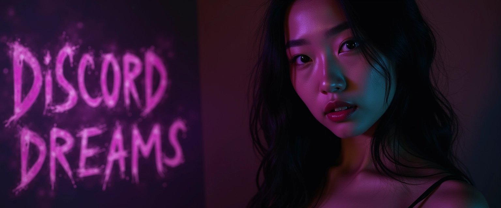

# Discord Dreams - AI Roleplay Bot

So, you want to make an AI roleplay bot for Discord? Here's one. It's called Discord Dreams. It does stuff. Your imagination (and your API budget) is your limit!

## Features

- **Multiple Characters**: Create as many AI characters as you want. Go nuts.
- **AI Model Switching**: Use Claude, OpenRouter, or LMStudio. Choose your poison.
- **Text-to-Speech**: Make your AI talk. Revolutionary, I know.
- **Image Generation**: Your AI can send selfies. Because apparently that's a thing now.
- **Conversation Management**: Edit or delete conversation history. Useful for when your AI says something stupid.
- **Character Customization**: Adjust your AI's personality. Make it as annoying as you want. Or.. whatever.
- **Organized Output**: All conversation logs and generated content are neatly organized in an 'output' folder. Because who doesn't love a tidy bot?

## Prerequisites

Here's what you need. Don't blame me if you can't figure it out:

- Python 3.7+
- Discord Bot Token
- API keys for Anthropic, OpenRouter, ElevenLabs, and Replicate
- A Language Model (LLM)
- ElevenLabs voices
- Selfie and face files for Stable Diffusion
- A system prompt

## Installation

### One-Click Installers (Recommended)

Use these one-click installers to set up Discord Dreams:

1. Clone the repo:
   ```
   git clone https://github.com/nai-research/discord-dreams.git
   cd discord-dreams
   ```

2. Run the installer for your operating system:

   - For macOS:
     ```
     bash install_mac.sh
     ```

   - For Windows:
     ```
     install_windows.bat
     ```

3. Follow the prompts to enter your API keys and other required information.

4. The installer will create a `characters.py` file based on the `characters_example.py` template. You'll need to edit this file to add your own characters.

5. Once the installation is complete, follow the instructions provided by the installer to run the bot.

### Manual Installation

If you're feeling adventurous or the one-click installers don't work for you, here's how to do it manually:

1. Clone the repo:
   ```
   git clone https://github.com/nai-research/discord-dreams.git
   cd discord-dreams
   ```

2. Create and activate a virtual environment:
   ```
   python -m venv venv
   source venv/bin/activate  # On Windows, use: venv\Scripts\activate
   ```

3. Install dependencies:
   ```
   pip install -r requirements.txt
   ```

4. Set up your config:
   - Create a `.env` file in the root directory
   - Add your API keys and configuration:
     ```
     DISCORD_BOT_TOKEN=your_discord_bot_token
     DISCORD_USER_ID=your_discord_user_id
     OPENROUTER_KEY=your_openrouter_api_key
     OPENROUTER_HTTP_REFERER=your_openrouter_http_referer
     ANTHROPIC_API_KEY=your_anthropic_api_key
     ELEVENLABS_API_KEY=your_elevenlabs_api_key
     REPLICATE_API_TOKEN=your_replicate_api_token
     DEFAULT_LLM=anthropic
     ```

5. Copy `characters_example.py` to `characters.py`:
   ```
   cp characters_example.py characters.py
   ```

6. Create an 'output' folder in the project root:
   ```
   mkdir output
   ```

## Character Setup

1. Open `characters.py` in your favorite text editor. You'll see an example character setup.

2. Customize the example character or add new characters following this format:

   ```python
   "character_name": {
       "system_prompt": "Character description goes here.",
       "image_prompt": "How the character looks, I guess.",
       "tts_url": "https://api.elevenlabs.io/v1/text-to-speech/VOICE_ID_HERE",
       "source_faces_folder": "path/to/faces/folder",
       "voice_settings": {
           "stability": 0.4,
           "similarity_boost": 0.45,
           "style": 0.5
       }
   }
   ```

3. Replace VOICE_ID_HERE with an ElevenLabs voice ID. Try not to pick something too annoying.

4. Add as many characters as you want. Just don't go overboard, okay?

## Usage

1. Start the bot:
   ```
   python main.py
   ```

2. Commands:
   - `!help` - Shows commands. You'll probably need this.
   - `!llm` - Switch AI models
   - `!claude`, `!openrouter`, `!lmstudio` - Switch to specific models
   - `!tts` - Toggle text-to-speech
   - `!narration` - Toggle narration
   - `!say` - Make the AI say something
   - `!selfie` - Generate a profile pic
   - `!video` - Make a talking animation
   - `!talker` - More advanced video generation
   - `!delete` - Delete the last message
   - `!edit` - Edit a message
   - `!resume` - Continue a previous conversation
   - `!set_voice`, `!get_voice` - Manage AI voice
   - `!restart` - Restart the bot
   - `!quit` - Stop the bot

## Output Organization

All conversation logs and generated content are now neatly organized in an 'output' folder. Here's how it works:

1. When you start a new conversation, you'll be prompted to enter a name for the log file.
2. A new subfolder will be created in the 'output' folder with the given name.
3. All files related to that conversation (logs, audio, images, videos) will be saved in this subfolder.
4. To resume a conversation, use the `!resume` command followed by the subfolder name.

Example folder structure:
```
project_root/
├── output/
│   ├── conversation_1/
│   │   ├── conversation_1.txt
│   │   ├── audio_files.mp3
│   │   └── image_files.png
│   ├── conversation_2/
│   │   └── ...
│   └── ...
├── main.py
├── conversation_manager.py
└── ...
```

This new structure keeps your project tidy and makes it easier to manage multiple conversations. You're welcome.

## Technical Details

- Uses Discord.py
- Asyncio for concurrent operations
- Error handling and logging
- Modular design
- Multiple AI model support
- Video generation with Replicate's API
- Environment variables for configuration
- Organized output structure for logs and generated content

## Contributing

If you want to contribute, go ahead. Just don't break anything.

That's it. Have fun with your AI roleplay bot, I guess.
